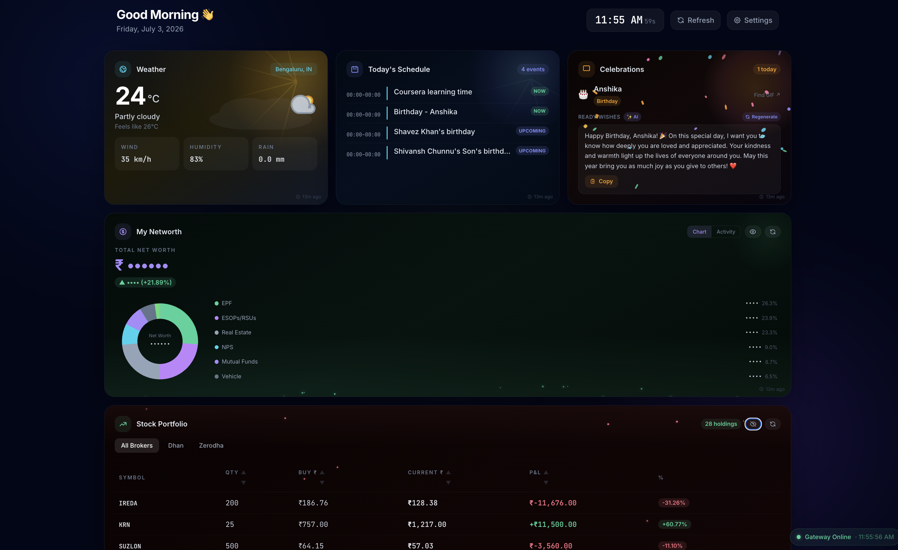
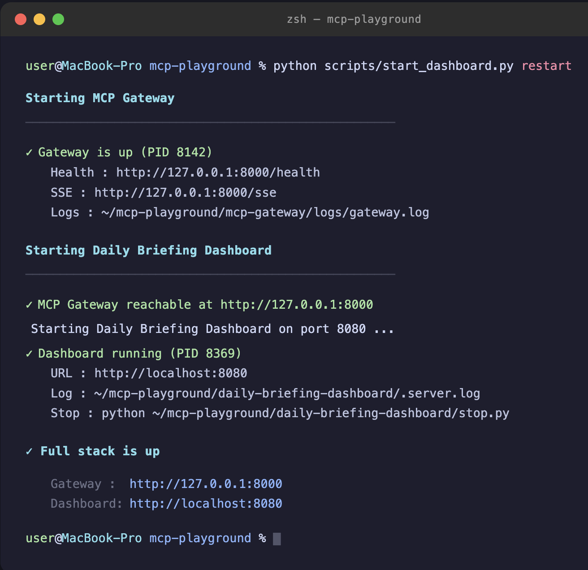

# MCP Playground

> A local MCP gateway that aggregates tools and services behind a single SSE endpoint — connect any MCP-compatible frontend (Claude Desktop, Gemini Desktop, Cursor, or your own dashboard) without repeating auth or configuration.

---

## Demo

### Dashboard



### Starting the Stack



---

## What We Are Building

Two components live in this repo:

| Component | Role |
|-----------|------|
| [`mcp-gateway/`](mcp-gateway/) | Local MCP server (Python / FastAPI). Hosts tools, owns Google OAuth, enforces rate limits and audit logging. Any MCP client connects here. |
| [`daily-briefing-dashboard/`](daily-briefing-dashboard/) | Personal morning dashboard (Node / Express + vanilla JS). Connects to the gateway via SSE, renders weather, Gmail, Calendar, and stock portfolio. |

The gateway is the stable core. The dashboard is one consumer. Claude Desktop, Gemini Desktop, Cursor, and any other MCP-aware app are other consumers — all reading from the same gateway, with no duplicated credentials.

---

## Platform Setup Guides

All management scripts are written in Python and run identically on Windows, macOS, and Linux. Pick the guide for your OS:

| Platform | Guide |
|----------|-------|
| **Windows 10 / 11** | [docs/windows-setup.md](docs/windows-setup.md) — step-by-step: install Python & Node.js, credential setup, running the stack, troubleshooting |
| **macOS / Linux** | [docs/development.md](docs/development.md) — local setup, Google auth, service management |

> All management scripts are `.py` files and run identically on Windows, macOS, and Linux. No shell scripts are required.

---

## Repository Layout

```
mcp-playground/
├── mcp-gateway/              # Python FastAPI MCP server
│   ├── src/
│   │   ├── main.py           # FastAPI app, MCP server wiring, auth + config endpoints
│   │   ├── tools/            # One file per tool (weather, gmail, calendar, stocks, calculator)
│   │   ├── services/         # Google client factory + credential loader
│   │   ├── auth/             # Token manager (keychain, refresh, expiry)
│   │   ├── config/           # Settings (pydantic-settings) + secrets (keyring)
│   │   └── utils/            # Rate limiter, JSON audit logger, error types
│   ├── scripts/              # One-off helpers (auth_all.py)
│   ├── mcp_gateway.py        # Gateway manager: setup / start / stop / status / restart
│   ├── requirements.txt
│   └── .env.example          # Config template — copy to .env and fill in your values
│
├── daily-briefing-dashboard/ # Node/Express + React frontend
│   ├── server.js             # Express server: gateway proxy, LLM endpoints, auto-build
│   ├── src/                  # React app (Vite) — auto-built on first server start
│   ├── public/               # Legacy static fallback (used only when dist/ is absent)
│   └── daily_dashboard.py    # Dashboard manager: start / stop / status / restart
│
├── docs/
│   ├── architecture.md       # System design, data flows, design decisions
│   ├── development.md        # macOS / Linux setup guide
│   ├── deployment.md         # Deploy process and secrets checklist
│   └── windows-setup.md      # Windows 10/11 step-by-step setup guide
│
└── scripts/
    └── start_dashboard.py    # Unified stack: start / stop / restart / status  (all platforms)
```

---

## Quick Start

> For a detailed walk-through see the platform guide for your OS above.

### Option A — Full stack in one command (recommended)

```bash
# All platforms — from the repo root
python scripts/start_dashboard.py start
```

```powershell
# Windows PowerShell equivalent (same command)
python scripts\start_dashboard.py start
```

This handles first-run setup automatically: creates `.venv`, installs Python and Node dependencies, builds the React app, then launches both services and opens your browser.

### Option B — Step by step

**Step 1 — Gateway setup (first run only)**

```bash
cd mcp-gateway
python mcp_gateway.py setup
```

This creates `.venv`, installs dependencies, and copies `.env.example` → `.env`.

Edit `mcp-gateway/.env` and fill in your `GOOGLE_CLIENT_ID` and `GOOGLE_CLIENT_SECRET`, then authorise Google:

```bash
.venv/bin/python scripts/auth_all.py        # macOS / Linux
.venv\Scripts\python.exe scripts\auth_all.py  # Windows
```

**Step 2 — Start the gateway**

```bash
python mcp-gateway/mcp_gateway.py start     # starts on http://127.0.0.1:8000
```

**Step 3 — Start the dashboard**

```bash
python daily-briefing-dashboard/daily_dashboard.py start   # starts on http://localhost:8080
```

Open [http://localhost:8080](http://localhost:8080), then **Settings → Google → Connect Google**.

**Stopping the stack**

```bash
python scripts/start_dashboard.py stop
```

**Checking status**

```bash
python scripts/start_dashboard.py status
```

---

## Connecting AI Clients

The gateway speaks standard MCP-over-SSE. Connect any MCP-compatible client to `http://127.0.0.1:8000/sse` — all clients share the same tools and tokens simultaneously.

### Claude Desktop

Edit `~/Library/Application Support/Claude/claude_desktop_config.json`:

```json
{
  "mcpServers": {
    "mcp-gateway": {
      "url": "http://127.0.0.1:8000/mcp"
    }
  }
}
```

Quit and reopen Claude Desktop. Tools appear in the hammer icon menu.

### Gemini Desktop

1. Open Gemini Desktop → **Settings** → **Extensions** (or **MCP Servers**).
2. Click **Add server**.
3. Set type to `SSE` or `HTTP`, URL to `http://127.0.0.1:8000/mcp`.
4. Save. The status indicator turns green when the gateway is running.

### Cursor

Settings → Features → MCP → **+ Add New MCP Server** → type `http`, URL `http://127.0.0.1:8000/mcp`.

### VS Code — Cline / Roo Code

```json
{ "mcpServers": { "mcp-gateway": { "url": "http://127.0.0.1:8000/mcp" } } }
```

See [mcp-gateway/INTEGRATION.md](mcp-gateway/INTEGRATION.md) for step-by-step instructions, screenshots-level detail, troubleshooting tips, and Python SDK usage.

---

## Available Tools

| Tool | Auth required | Description |
|------|---------------|-------------|
| `calculate` | — | Safe math expression evaluator |
| `get_weather` | — | Current weather via wttr.in, with IMD alerts for Indian cities |
| `gmail_list_latest` | Google | Latest inbox emails (subject, sender, snippet) |
| `calendar_list_events` | Google | Upcoming events from Google Calendar |
| `get_stocks` | Google | Stock portfolio from a configured Google Sheet |
| `indmoney_*` | IndMoney | All tools from IndMoney MCP (networth, SIPs, holdings, etc.) — proxied via OAuth 2.1 + PKCE |

---

## Key Design Decisions

- **Single OAuth token for all Google services.** Gmail, Calendar, Drive, and Sheets share one set of scopes and one refresh token stored in the OS credential store (macOS Keychain / Windows Credential Manager / Linux Secret Service).
- **Gateway owns auth, not clients.** Frontends never handle credentials. The gateway exposes `/auth/google` → `/auth/callback` for browser-based OAuth and stores the token in keychain.
- **SSE transport, not stdio.** A persistent SSE connection means the gateway runs once as a daemon; any number of clients connect without spawning subprocesses.
- **Rate limiting per tool.** Token-bucket limiter (in-memory, per tool name) guards against runaway AI loops.
- **Daily rotating JSON audit log.** Every tool call and auth event is written to `~/.local/mcp-gateway/logs/audit-YYYY-MM-DD.log`.

---

## Security

- All secrets live in `.env` (gitignored) or the system credential store (macOS Keychain / Windows Credential Manager / Linux Secret Service) — never in code.
- `.env.example` files contain only placeholder values — no real credentials.
- CORS is restricted to `DASHBOARD_ORIGIN` on both the gateway and dashboard.
- OAuth state tokens expire after 5 minutes; `postMessage` targets only the configured dashboard origin.
- Security headers (`X-Frame-Options`, `Content-Security-Policy`, `X-Content-Type-Options`, etc.) are set on all responses.
- Input validation on all config endpoints: spreadsheet IDs, URLs, and tool names are regex-checked before use.
- Never commit or push automatically — all git actions are manual.

See [`.github/SECURITY.md`](.github/SECURITY.md) for the full security design and [docs/deployment.md](docs/deployment.md) for the secrets checklist.
